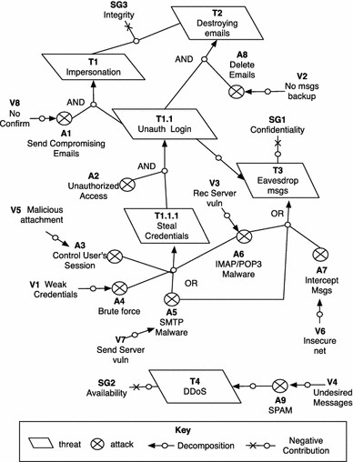

#### Thread Model of Email service:

#### Recommendations
* Choose an unbreakable password: The longer the password, the harder it is to bruteforce. Consider a 12-character password or longer. Things to avoid: Names, places, dictionary words. Mix it up. Use variations on capitalization, spelling, numbers, and punctuation.
* Never reuse the same password. Keep original passwords for your most important tools, apps, and websites
* Do not sign in from the suspicious network, places or public computers.
* Keep written passwords stored securely.
* Look at urls to check if a site's connection is secure and spelled properly
* Only open email attachments that are expected and that come from a trusted source
* Use Internet security software that will automatically scan email attachments for malware and viruses
* Delete any messages and attachments you aren’t sure about without opening them
* You should check the file type of any attachment before opening it. Malware and viruses can be hidden in files of the following file extensions; .ade, .adp, .asf, .bas, .bat, .chm, .cmd, .com, .cpl, .crt, .exe, .hlp, .hta, inf, .ins, .isp, .js, .jse, .lnk, .mdb, .mde, .mov, .msc, .msi, .msp, .mst, .pcd, .pif, .reg, .scr, .sct, .shs, .swf, .url, .vb, .vbe, .vbs, .wsc, .wsf, .wsh, etc

#### Terms:
Attack surface is used to identify the components of the system that may contain any vulnerabilities. The software surface can be one of email services, databases, executables, DLLs, web pages, mobile apps and device OS, etc. The network attack surface presents exposure related to ports, protocols, channels. The human attack surface can be phishing (obtaining sensitive information by communication), also something like the ability to attach, read or write to removable devices. A vulnerability is a weakness in a system which may be used to alter the intended behavior of the system. Attack vector (types of attacks) refers to identifying which attack can be done, based on identified vulnerabilities (no input validation) such as SQLI, XSS. An exploit is the tool used to carry on an attack. Computer exploits can be characterized by the expected result of the attack, such as denial of service, remote code execution, privilege escalation, malware delivery or other malicious goals.

#### Threat Model Analysis:
* Identify use-case scenarios. For each use-case scenario for your target environment, identify how you expect your company to use the target environment, and any limitations or restrictions on the target environment. This information helps define the scope of the threat model discussion, and provides pointers to assets (anything of value to your company, such as data and computers) and entry points.
* Create a data flow diagram for each scenario.
* Determine the boundaries and scope of the target environment.
* Understand the boundaries between trusted and untrusted components.
* Understand the configuration and administration model for each component.
* Create a list of external dependencies.
* Create a list of assumptions about other components on which each component depends. This helps validate cross-component assumptions, action items, and follow-up items with other teams.
* To review threats you can use the following effect categories to calculate risk exposure: Damage potential, Reproducibility, Exploitability, Affected users, and Discoverability.